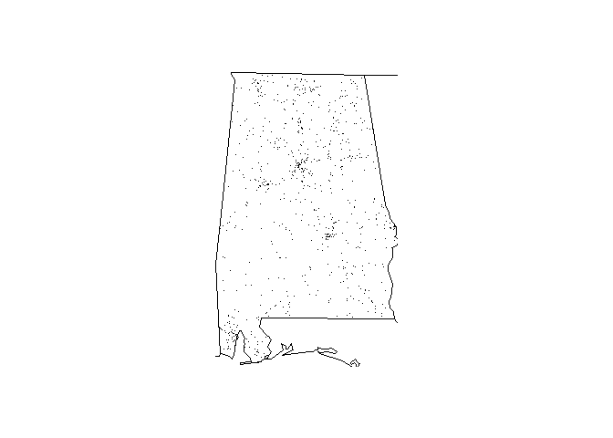

<!-- README.md is generated from README.Rmd. Please edit that file -->
The `fars.pack` package loads, aggregates and plots FARS data. Here is an example of the package in action.

``` r
require(fars.pack)
#> Loading required package: fars.pack
old_path <- getwd()
file_path <- system.file("extdata", package = "fars.pack")
dir(file_path)
#> [1] "accident_2015.csv.bz2"
setwd(file_path)

# read data
fars2015 <- fars_read(dir()[1])
head(fars2015)
#> # A tibble: 6 x 52
#>   STATE ST_CASE VE_TOTAL VE_FORMS PVH_INVL  PEDS PERNOTMVIT PERMVIT
#>   <int>   <int>    <int>    <int>    <int> <int>      <int>   <int>
#> 1     1   10001        1        1        0     0          0       1
#> 2     1   10002        1        1        0     0          0       1
#> 3     1   10003        1        1        0     0          0       2
#> 4     1   10004        1        1        0     0          0       1
#> 5     1   10005        2        2        0     0          0       2
#> 6     1   10006        1        1        0     0          0       2
#> # ... with 44 more variables: PERSONS <int>, COUNTY <int>, CITY <int>,
#> #   DAY <int>, MONTH <int>, YEAR <int>, DAY_WEEK <int>, HOUR <int>,
#> #   MINUTE <int>, NHS <int>, RUR_URB <int>, FUNC_SYS <int>,
#> #   RD_OWNER <int>, ROUTE <int>, TWAY_ID <chr>, TWAY_ID2 <chr>,
#> #   MILEPT <int>, LATITUDE <dbl>, LONGITUD <dbl>, SP_JUR <int>,
#> #   HARM_EV <int>, MAN_COLL <int>, RELJCT1 <int>, RELJCT2 <int>,
#> #   TYP_INT <int>, WRK_ZONE <int>, REL_ROAD <int>, LGT_COND <int>,
#> #   WEATHER1 <int>, WEATHER2 <int>, WEATHER <int>, SCH_BUS <int>,
#> #   RAIL <chr>, NOT_HOUR <int>, NOT_MIN <int>, ARR_HOUR <int>,
#> #   ARR_MIN <int>, HOSP_HR <int>, HOSP_MN <int>, CF1 <int>, CF2 <int>,
#> #   CF3 <int>, FATALS <int>, DRUNK_DR <int>

# plot data
# state number 1
fars_map_state(1, 2015)
#> Warning: package 'bindrcpp' was built under R version 3.3.3
```


